# Product & User Funnel Analytics

## Project Overview

This project analyzes the end-to-end customer journey of an e-commerce
business, from **Website Visit → Product View → Add to Cart → Checkout
Started → Purchase Completed**.

The objective is to identify the biggest funnel bottlenecks, understand
how performance varies across devices, acquisition channels, campaigns
and user types, and translate the findings into actionable business
recommendations.

The analysis covers **120,000 sessions**.

------------------------------------------------------------------------

## Business Problem

The business generates significant website traffic, but only a small
proportion of sessions result in completed purchases.

The analysis aims to answer:

-   Where are users dropping out of the purchase funnel?
-   Which funnel stages have the largest conversion problems?
-   Does device affect funnel performance?
-   Which acquisition channels bring higher-quality traffic?
-   How do campaign types perform?
-   How significant are cart and checkout abandonment?
-   Where should the business focus its optimization efforts?

### Key Business Question

> **How can the company improve purchase conversion by identifying the
> biggest funnel bottlenecks and understanding which segments contribute
> to funnel inefficiencies?**

------------------------------------------------------------------------

## Project Objectives

1.  Measure overall funnel performance and purchase conversion.
2.  Identify the largest user drop-off points.
3.  Compare funnel performance across devices.
4.  Evaluate acquisition channels based on traffic, conversion and
    revenue.
5.  Compare campaign performance across funnel stages.
6.  Analyze cart abandonment.
7.  Analyze checkout abandonment.
8.  Translate findings into practical business recommendations.

------------------------------------------------------------------------

## Tools & Technologies

-   **Python:** Pandas, NumPy, Matplotlib
-   **Power BI:** DAX, interactive dashboards, KPI cards, funnel
    analysis, matrix/conditional formatting
-   **GitHub:** Project documentation and portfolio presentation

------------------------------------------------------------------------
# Analysis Performed

## 1. Overall Funnel Performance

  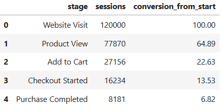

**Key finding:** Only **6.82%** of website sessions resulted in a
completed purchase.

------------------------------------------------------------------------

## 2. Funnel Drop-off Analysis

  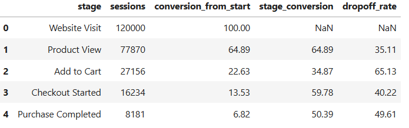

**Key finding:** Product → Cart is the biggest bottleneck, followed by
Checkout → Purchase.

------------------------------------------------------------------------

## 3. Funnel Analysis by Device

  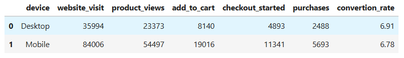

**Key finding:** Mobile has much higher traffic, but conversion rates
are very similar to Desktop. Device does not appear to be the main
driver of funnel performance.

------------------------------------------------------------------------

## 4. Funnel Analysis by Acquisition Channel

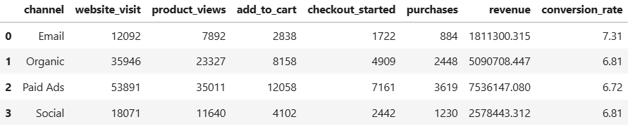

**Key findings:** - Paid Ads generates the most traffic, purchases and
revenue. - Email has the highest conversion rate at 7.31%. - Channel
conversion differences are relatively small.

------------------------------------------------------------------------

## 5. Campaign Performance Analysis

  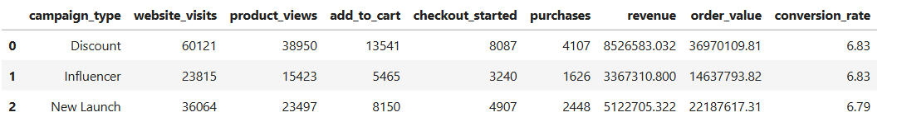

**Key findings:** - Discount campaigns generate the highest traffic,
purchases and revenue. - New Launch has the highest revenue per session
at approximately ₹142.04. - Campaign conversion rates are very similar,
ranging from 6.79% to 6.83%.

### Campaign Funnel Performance

  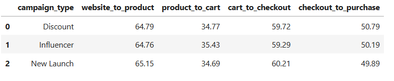
------------------------------------------------------------------------

## 6. Cart Abandonment Analysis

  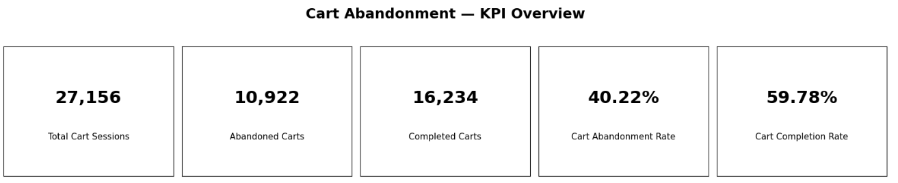

### Segment Findings

-   Desktop: **39.89%**
-   Mobile: **40.36%**
-   Email: **39.32%**
-   Organic: **39.83%**
-   Paid Ads: **40.61%**
-   Social: **40.47%**
-   Discount: **40.28%**
-   Influencer: **40.71%**
-   New Launch: **39.79%**
-   New users: **39.89%**
-   Returning users: **40.84%**

**Key finding:** Cart abandonment is consistently around 40% across
segments, suggesting a broader cart/checkout experience issue rather
than a problem isolated to one segment.

------------------------------------------------------------------------

## 7. Checkout Abandonment Analysis

  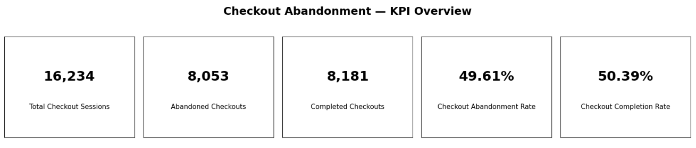

### Segment Findings

-   Desktop: **49.15%**
-   Mobile: **49.80%**
-   Email: **48.66%**
-   Organic: **50.13%**
-   Paid Ads: **49.46%**
-   Social: **49.63%**
-   Discount: **49.21%**
-   Influencer: **49.81%**
-   New Launch: **50.11%**
-   New users: **49.35%**
-   Returning users: **50.09%**

**Key finding:** Almost half of checkout sessions do not result in a
purchase.

------------------------------------------------------------------------

# Overall Business Insights

1.  **Product → Cart is the biggest funnel bottleneck**, with a 65.13%
    drop-off.
2.  **Checkout abandonment is another major issue**, with 49.61% of
    checkout sessions failing to convert.
3.  Device, channel, campaign and user-type differences are relatively
    small, suggesting the core funnel experience is more important than
    segment-specific optimization.
4.  **Paid Ads is the largest scale opportunity** because it generates
    the highest traffic and revenue.
5.  **Email is a useful benchmark** because it has the highest
    conversion rate and strong revenue per session.

------------------------------------------------------------------------

# Overall Business Recommendations

### Priority 1 --- Improve Product → Cart Conversion

Investigate product pricing, product information, images, reviews,
availability, shipping information and the Add-to-Cart experience.

### Priority 2 --- Reduce Checkout Abandonment

Investigate payment failures, unexpected costs, shipping charges,
payment options, checkout complexity, coupon issues and technical
errors.

### Priority 3 --- Optimize High-Volume Traffic

Paid Ads generates the most traffic, so even a modest improvement in its
conversion rate could produce meaningful additional purchases.

### Priority 4 --- Learn From High-Performing Traffic

Use Email as a benchmark and investigate what characteristics are
associated with its stronger conversion performance.

### Priority 5 --- Use A/B Testing

Test improvements to product pages, cart experience, checkout flow,
payment options, shipping presentation and promotions instead of relying
only on assumptions.

### Priority 6 --- Add More Business Data

Future analysis could incorporate marketing spend, CAC, CPA, ROAS,
product category, product price, shipping cost, payment method, payment
failures, checkout errors and page-load performance.

------------------------------------------------------------------------

# Power BI Dashboard

The project is presented through three dashboard pages:

### Page 1 --- Executive Funnel Overview

-   Total sessions
-   Purchase Completed
-   Revenue
-   conversion rate
-   Overall funnel
-   Funnel drop-offs
-   Monthly conversion trend
-   Sessions lost
-   Stage conversion %

 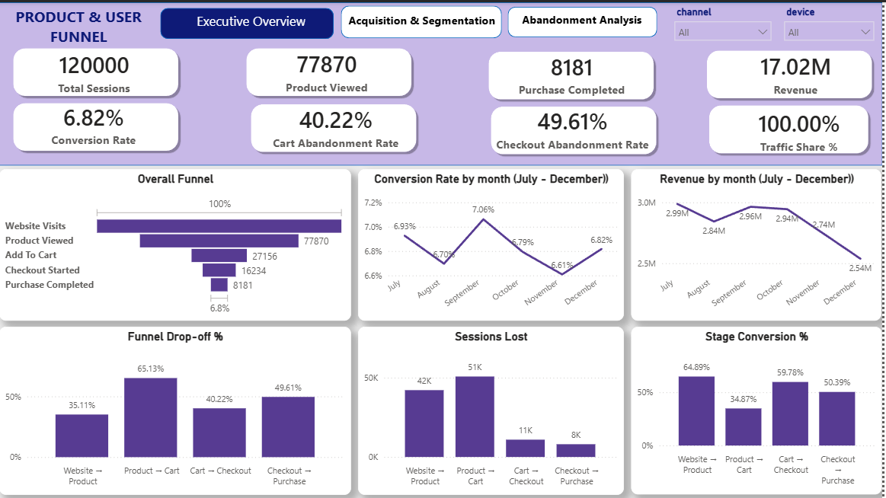
  

### Page 2 --- Acquisition & Campaign Performance

-   Traffic by acquisition channel
-   Traffic share
-   Conversion by channel
-   Revenue by channel
-   Campaign performance
-   Campaign funnel Performance
-   Top Channel and Top campaign 

 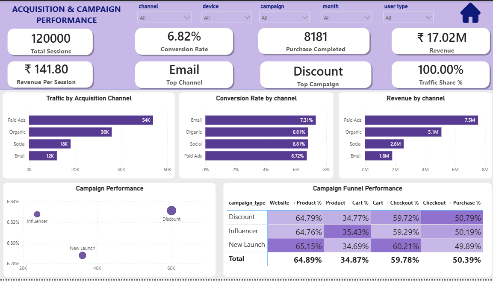

### Page 3 --- Cart & Checkout Abandonment

-   Cart sessions
-   Abandoned carts
-   Cart abandonment rate
-   Checkout sessions
-   Abandoned checkouts
-   Checkout abandonment rate
-   Abandonment by device
-   Abandonment by channel
-   Abandonment by campaign
-   New vs Returning users
  
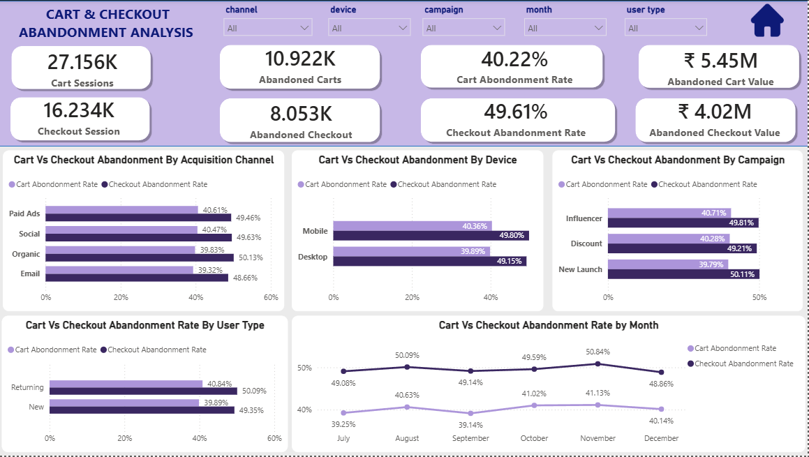
------------------------------------------------------------------------

# Skills Demonstrated

-   Data cleaning and preparation
-   Exploratory Data Analysis
-   Funnel analysis
-   Conversion analysis
-   Drop-off analysis
-   Customer segmentation
-   Acquisition channel analysis
-   Campaign performance analysis
-   Cart abandonment analysis
-   Checkout abandonment analysis
-   KPI development
-   DAX
-   Power BI dashboard development
-   Business storytelling
-   Data-driven recommendations

------------------------------------------------------------------------

## Final Takeaway

The analysis shows that the biggest opportunities are **improving
Product → Cart conversion and reducing Checkout → Purchase
abandonment**. Since differences across devices, channels, campaigns and
user types are relatively small, the business should focus primarily on
improving the overall shopping and checkout experience while optimizing
high-volume traffic sources such as Paid Ads.
